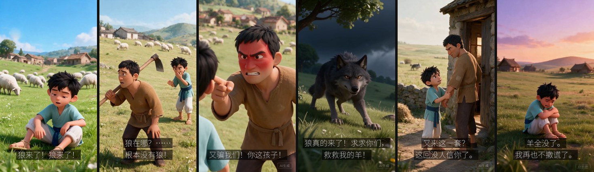
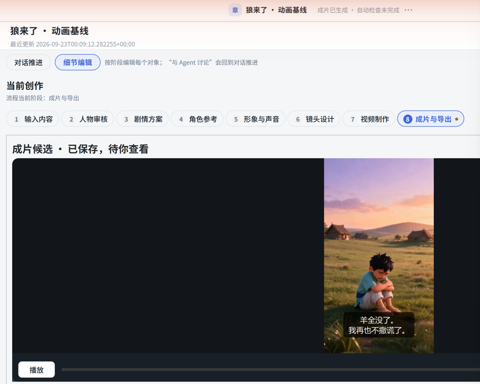

<h1 align="center">章节短剧工作台</h1>

从文本、角色与分镜，到配音、视频和字幕的一体化制作 Agent

  

  <a href="https://github.com/chenyihang98-pixel/chapter-drama-agent-showcase/raw/main/assets/demo/fable-48s.zh.mp4"><b>▶ 观看演示</b></a>（下载 MP4，约 14 MB）
  &nbsp;·&nbsp;
  <a href="assets/demo/fable-48s.zh.srt">字幕文件（SRT）</a>

《狼来了》 · 48 秒 · 6 个镜头 · 中文配音与字幕 · 9:16 竖屏

视频超出 GitHub 页面内预览的大小限制，点击后会下载 MP4，可用任意播放器观看；中文字幕已内嵌在画面中。

**章节短剧工作台**（小说转动画短剧 Agent）是一款本地桌面应用：导入小说章节或短篇故事后，它按用途调用五类模型服务，整理人物、剧情与分镜，制作人物形象、关键帧、配音和镜头视频，关键环节由你确认，最后在本地合成带中文字幕的竖屏短片。

  <a href="#演示">演示</a> ·
  <a href="#能做什么">能做什么</a> ·
  <a href="#整体架构">整体架构</a> ·
  <a href="#模型分工">模型分工</a> ·
  <a href="#使用流程">使用流程</a> ·
  <a href="#工程要点">工程要点</a> ·
  <a href="#关于本仓库">关于本仓库</a>

## 演示

从演示视频的六个镜头中各截取一帧，仅缩小拼接，画面未作改动：喊“狼来了” → 村民扑空 → 再次受骗 → 狼真的来了 → 没人再信 → 失去羊群。

这段短片是应用在开发阶段的一次真实制作：画面与配音由下文所列的模型服务生成，合成与字幕在本地完成。制作中包含人工确认和必要修正，例如第 3 镜头的首次视频请求未通过服务方内容审核，经单独确认后只重做了这一个镜头。最终的自动文字检查没有完成。因此这段短片只用于展示流程和效果，不是质量评测或成功率数据。画面右下角的「AI生成」标识由服务方添加，已原样保留。

## 能做什么

**分阶段的制作流程** 
把原文分析、人物与剧情规划、分镜、关键帧、配音和视频制作组织成前后衔接的步骤，接入五类模型服务。角色、镜头、台词和素材相互关联：每句台词属于哪个角色、落在哪个镜头，每个镜头用了哪张关键帧，都有记录可查。

**先检查，再确认** 
人物名单、剧情方案、人物形象、声线、镜头描述和关键帧都由你审核或选用；关键帧还会由画面检查模型逐项核对人数、外貌一致性、道具、场景和动作起点，检查通过的关键帧才能用于视频制作。每一轮付费制作开始前，应用会列出本次使用的模型、新增调用次数上限和参考费用（估算值），确认后才发送请求。

**保存进度，按步恢复** 
任务进度、模型配置、已采用的素材和远端任务编号都保存在本地，中断后可以接着做，已完成的镜头和配音直接复用。应用会区分请求失败、已发送但结果未知、未通过内容审核等不同情况，只针对当前步骤处理恢复，不会整片重来，也不会在结果未知时自动重发。

**本地合成与导出** 
先生成正式配音，按实际时长排好每个镜头内的台词，再制作视频；最后用 FFmpeg 在本地合成。播放器支持字幕开关和音量调节，可导出带字幕或无字幕的 MP4、SRT 字幕和项目资料包。《狼来了》的 48 秒成片就是通过应用实际制作的，成片的保存、播放和重新打开后的复用都经过验证。

## 整体架构

模型只负责生成和检查候选；任务状态、人工决定和素材选用由应用保存在本地，合成与导出也在本地完成。各步骤之间的依赖并非一条直线，详见 [架构与流程](docs/架构与流程.md)。

## 模型分工

| 用途 | 演示所用模型（服务方） | 在流程中的作用 |
|---|---|---|
| 剧情与分镜 | Kimi K3（月之暗面） | 原文理解、人物分析、剧情方案、台词与镜头设计，以及文字层面的检查 |
| 画面检查 | Qwen3.8-Max（阿里云 · 通义千问） | 对照人物设定与镜头要求，逐项检查关键帧 |
| 人物与关键帧 | Seedream 5.0 Pro（火山引擎 · 火山方舟） | 生成人物形象图和各镜头关键帧 |
| 镜头视频 | Seedance 2.5（火山引擎 · 火山方舟） | 以选用的关键帧为首帧，生成每个镜头的视频片段 |
| 角色对白与旁白 | Seed TTS 2.0（火山引擎 · 豆包语音） | 按角色声线合成台词与旁白 |
| 合成、字幕与导出 | FFmpeg 与应用代码（本地） | 按配音时间轴拼接画面与声音，生成字幕并导出，不调用 AI 服务 |

演示版本保存的具体模型 ID 与接入方式见 [模型与接口](docs/模型与接口.md)。

## 使用流程

应用把一次创作分为八个步骤，在「细节编辑」中可以按步骤查看和修改：

1. **输入内容**：粘贴或导入原文，可附上改编意图。
2. **人物审核**：核对模型整理出的人物名称与关系，确认后采用。
3. **剧情方案**：核对摘要、台词和建议时长。
4. **角色参考**（可选）：为人物导入参考图，或直接跳过。
5. **形象与声音**：选用人物形象，试听并选定声线，生成正式配音。
6. **镜头设计**：确认镜头描述与画风，选用检查通过的关键帧。
7. **视频制作**：查看制作范围与参考费用，确认后逐镜头制作；个别镜头可单独重做。
8. **成片与导出**：播放、开关字幕、调节音量，导出视频、字幕和项目资料。

除了按步骤编辑，也可以在「对话推进」中用自然语言说明想法，由文字模型整理成待确认的提案；涉及费用或正式结果的改动仍需你明确确认。

应用界面截图（已裁剪）：第 8 步「成片与导出」的播放器，显示按实际配音更正后的两行字幕；顶部状态为「成片已生成 · 自动检查未完成」。

## 工程要点

- **技术栈**：Python；PySide6（Qt Quick / QML）桌面界面；SQLite 保存任务状态与人工决定；FFmpeg / ffprobe 负责合成、字幕渲染与导出校验。
- **任务状态持久化**：每一步的进度、候选与选用、人工确认、请求结果和远端任务编号都写入本地数据库。远端视频仍在生成时，继续制作会接着获取同一个任务，而不是重新提交。
- **结果复用**：新一轮制作只为缺少结果的镜头发起请求。演示中第 4–6 镜头的制作沿用了已保存的前 3 个镜头和全部 11 段正式配音；重新打开已完成的任务时直接读取保存的成片，不再发出模型请求。
- **固定配置，不悄悄替换**：项目固定所用的模型配置；配置被停用或删除时，应用会停止发送并提示，不会自动改用其他模型。
- **统一的时间与字幕来源**：台词排时由同一条规则计算，审核预览、制作前检查和最终合成都用它；播放器字幕、SRT/VTT 文件和带字幕视频也共用同一份字幕数据，字幕文字与实际朗读内容一致。

## 关于本仓库

- 这是项目展示仓库，包含项目说明、架构与模型分工文档，以及《狼来了》演示视频和字幕。**不包含**应用源码、安装包、模型配置或任何密钥。
- 演示使用了真实的模型服务，并经过人工确认与修正；它展示的是开发阶段的一次制作结果，不代表质量评测、成功率、耗时或成本数据。
- 文中的模型名称与 ID 是演示版本当时保存的设置，不代表服务方当前的可用性，也不保证与其他账号或接口兼容。
- 本仓库未附带开源许可证，内容仅供了解项目。演示视频的画面与声音由第三方模型服务生成，其使用受相应服务条款约束。
