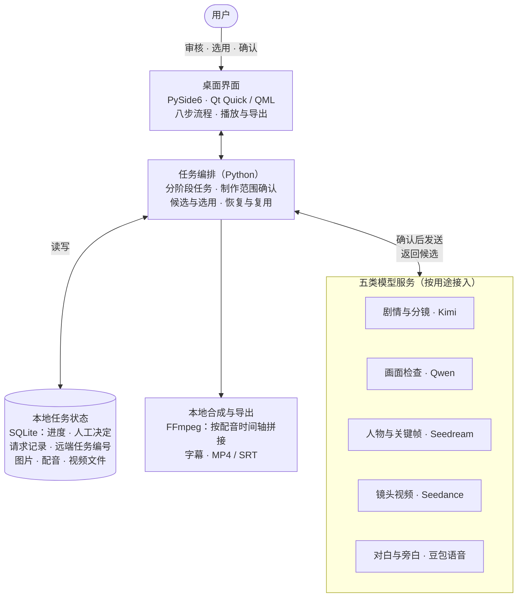

<h1 align="center">章节短剧工作台</h1>

小说转动画短剧 Agent：从文本、角色与分镜，到配音、视频和字幕的一体化制作

  

  <a href="https://github.com/chenyihang98-pixel/chapter-drama-agent-showcase/raw/main/assets/demo/fable-48s.zh.mp4"><b>▶ 观看演示：《狼来了》</b></a> 
  48 秒 · 6 个镜头 · 中文配音与字幕 · 9:16 竖屏

## 简介

章节短剧工作台是一款桌面应用。导入小说章节或短篇故事后，按步骤完成人物与剧情整理、分镜设计、人物形象与关键帧生成、角色配音和镜头视频制作，最后在本地合成带字幕的竖屏短片。

## 功能

- **分阶段制作**：输入原文 → 人物审核 → 剧情方案 → 角色参考（可选）→ 形象与声音 → 镜头设计 → 视频制作 → 成片与导出，每一步都可以查看和修改。
- **确认后执行**：人物、剧情、形象、声线和关键帧由用户选用；付费请求发送前列出所用模型、调用次数和参考费用。
- **进度保存与复用**：任务进度、已选素材和远端任务状态保存在本地，中断后可以继续，已完成的镜头和配音直接复用。
- **本地合成与导出**：按配音时长排布台词，用 FFmpeg 合成成片；支持字幕和音量调节，可导出 MP4 与 SRT。

## 架构

## 模型分工

| 用途 | 模型 |
|---|---|
| 剧情与分镜 | Kimi K3（月之暗面） |
| 画面检查 | Qwen3.8-Max（阿里云） |
| 人物与关键帧 | Seedream 5.0 Pro（火山方舟） |
| 镜头视频 | Seedance 2.5（火山方舟） |
| 对白与旁白 | Seed TTS 2.0（豆包语音） |
| 合成与导出 | FFmpeg（本地） |

## 技术栈

Python · PySide6（Qt Quick / QML）· SQLite · FFmpeg

更多说明：[架构与流程](docs/架构与流程.md) · [模型与接口](docs/模型与接口.md)
