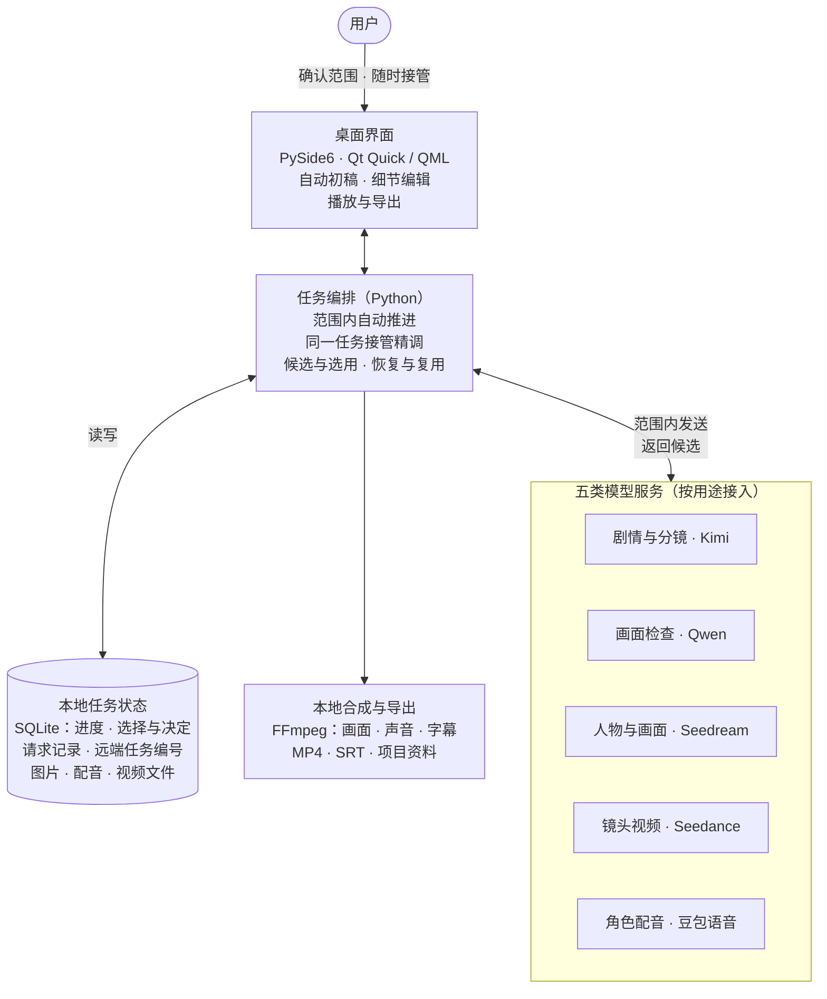

<h1 align="center">章节短剧工作台</h1>

从文本到动画与写实短片的一体化制作 Agent

  

  <a href="https://github.com/chenyihang98-pixel/chapter-drama-agent-showcase/raw/main/assets/demo/jiangjinjiu-49s.zh.mp4"><b>▶ 将进酒｜49 秒｜写实诗词节选｜中文朗诵与字幕</b></a>

<table>
  <tr>
    <td align="center">
       
      <a href="https://github.com/chenyihang98-pixel/chapter-drama-agent-showcase/raw/main/assets/demo/kezhou-40s.zh.mp4">▶ 刻舟求剑</a> 
      40 秒｜动画寓言
    </td>
    <td align="center">
       
      <a href="https://github.com/chenyihang98-pixel/chapter-drama-agent-showcase/raw/main/assets/demo/fable-48s.zh.mp4">▶ 狼来了</a> 
      48 秒｜动画寓言
    </td>
  </tr>
</table>

作品演示 · 点击封面或标题观看（MP4）

## 简介

章节短剧工作台是一款桌面应用。导入小说章节、故事或诗词并确认一次有限的制作范围后，应用会在范围内自动推进人物、剧情、分镜、画面、配音和镜头视频，并在本地合成带字幕的竖屏初稿；你也可以随时接管同一任务，逐项精调。

## 功能

- **自动初稿**：确认一次制作范围（风格、上传素材与调用上限），应用在范围内完成常规选择与推进，生成带字幕的初稿，检查中发现的问题作为备注保留。
- **同一任务精调**：随时接管，在细节编辑中修改剧情、形象、声音或单个镜头，改完可以继续自动推进。
- **按原因恢复**：远端已接受的任务接着取回同一结果，结果未知的请求不自动重发，已保存的镜头与配音直接复用；需要你决定时会停下说明。
- **本地成片**：在本地合成画面、声音与字幕，导出 MP4、SRT 和项目资料。

## 架构

```mermaid
flowchart TB
    USER(["用户"]) -->|"确认范围 · 随时接管"| UI["桌面界面<br/>PySide6 · Qt Quick / QML<br/>自动初稿 · 细节编辑<br/>播放与导出"]
    UI <--> APP["任务编排（Python）<br/>范围内自动推进<br/>同一任务接管精调<br/>候选与选用 · 恢复与复用"]
    APP <-->|"范围内发送<br/>返回候选"| MODELS
    APP <-->|"读写"| DB[("本地任务状态<br/>SQLite：进度 · 选择与决定<br/>请求记录 · 远端任务编号<br/>图片 · 配音 · 视频文件")]
    APP --> FF["本地合成与导出<br/>FFmpeg：画面 · 声音 · 字幕<br/>MP4 · SRT · 项目资料"]
    subgraph MODELS["五类模型服务（按用途接入）"]
        direction LR
        T["剧情与分镜 · Kimi"]
        V["画面检查 · Qwen"]
        I["人物与画面 · Seedream"]
        M["镜头视频 · Seedance"]
        S["角色配音 · 豆包语音"]
    end
```

## 模型分工

| 用途 | 模型（演示使用配置） |
|---|---|
| 剧情与分镜 | Kimi K3（月之暗面） |
| 画面检查 | Qwen3.8-Max（阿里云） |
| 人物与画面 | Seedream 5.0 Pro（火山方舟） |
| 镜头视频 | Seedance 2.5（火山方舟） |
| 角色配音 | Seed TTS 2.0（豆包语音） |
| 合成与导出 | FFmpeg（本地） |

## 技术栈

Python · PySide6（Qt Quick / QML）· SQLite · FFmpeg

更多说明：[架构与流程](docs/架构与流程.md) · [模型与接口](docs/模型与接口.md)
