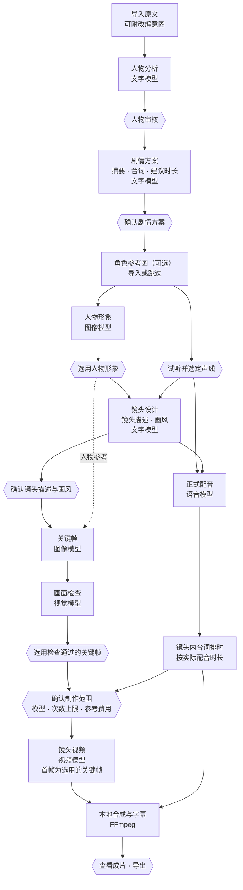

# 架构与流程

本文说明章节短剧工作台的分层结构、制作流程中的依赖关系、人工确认点，以及任务状态、恢复和本地合成的做法。内容依据应用当前的实现和《狼来了》演示的实际制作记录整理，不包含源码。

[← 返回首页](../README.md)

## 分层结构

| 层次 | 负责的事情 | 主要技术 |
|---|---|---|
| 桌面界面 | 八步流程与对话推进、候选查看与选用、制作范围确认、播放器（字幕开关、音量）、导出 | PySide6 · Qt Quick / QML |
| 任务编排 | 把一次创作拆成分阶段任务；生成制作范围与参考费用；记录人工决定；发送已确认的请求并跟踪远端任务；恢复与复用 | Python |
| 模型适配 | 按用途封装五类服务的请求与响应解析；校验结构化输出；拒收不符合本地规则的回复 | Python · HTTP |
| 任务状态 | 任务与阶段检查点、候选与选用、人工决定、请求记录（含远端任务编号与结果状态）、制作授权与已用次数 | SQLite |
| 媒体文件 | 人物形象、关键帧、配音、视频片段、字幕与成片，按任务保存在本地 | 本地文件 |
| 合成与导出 | 时间轴、合成、字幕生成与渲染、导出与校验 | FFmpeg / ffprobe |

模型服务只负责生成或检查候选。采用哪个结果、何时发送付费请求、失败后如何继续，都由应用根据保存的状态和你的确认来决定。

## 制作流程与依赖

界面按八个步骤展示一次创作，但各部分之间的依赖并不是一条直线：人物形象与声线在剧情方案确认后准备；镜头设计在形象与声音确定后生成；关键帧同时依赖镜头设计和人物形象；正式配音决定每个镜头内的台词时间；视频制作既需要选用的关键帧，也需要排好的台词时间。

方框是由模型或应用完成的工作，六边形是需要你确认或选用的节点。图中没有逐一画出的是：每一批付费请求（文字、图像、语音、视频）发送前都要确认范围，一次确认可覆盖其中列明次数以内的请求。

## 人工确认点

| 类型 | 何时出现 | 你的决定 |
|---|---|---|
| 发送前确认 | 每一批付费请求发送前 | 查看模型、新增调用次数上限和参考费用（估算值），确认后才发送 |
| 采用结果 | 人物名单、剧情方案、人物形象、声线、镜头描述与画风、关键帧 | 采用，或修改后再生成 |
| 异常处理 | 请求结果未知、镜头未通过服务方内容审核 | 是否为该步骤另行确认一次新请求；结果未知时需先确认可能重复计费的风险 |
| 成片与收尾 | 成片生成后 | 观看成片、导出文件、结束本轮制作 |

此外，「对话推进」允许用自然语言提出修改意见，由文字模型整理成提案；提案本身不会花钱或改变正式结果，仍要经过上面的确认。

## 状态保存、恢复与复用

- **保存什么**：任务的阶段进度与检查点、候选与选用、人工决定、请求记录（包括远端任务编号、结果状态和用量估算）、制作授权范围与已用次数；生成的媒体文件按任务保存在本地目录。
- **中断后继续**：应用重启后恢复到上次的任务。远端视频任务在本地等待结束后仍在生成时，继续制作会接着获取同一个视频，不会重新提交。
- **按结果分类**：区分请求失败、已发送但结果未知、未通过服务方内容审核、本地未接受模型回复等情况。结果未知的请求不会自动重发；若要另发新请求，需要先确认原请求可能已被处理或计费。
- **只处理当前步骤**：新一轮制作只为缺少结果的镜头发起请求，已保存的镜头、关键帧和配音直接沿用；修改前会先估算影响范围，例如单句重新配音不涉及图片和视频。
- **固定配置**：项目固定执行时使用的模型配置版本；配置被停用、删除或无法解析时拒绝发送并提示，不会改用其他模型。

## 配音、合成与字幕

- **正式配音先于视频**：视频制作前必须先生成并选用正式配音。每个镜头内的台词按实际配音时长依次排布；审核预览、制作前检查和最终合成使用同一条排时规则，避免“单句都不超时、合在一起却放不下”。
- **本地合成**：用 FFmpeg 把各镜头视频与配音按时间轴合成。对白和旁白由语音模型单独生成，合成时放入对应位置。
- **字幕**：字幕时间取自配音在时间轴上的实际位置，文字与实际朗读的内容一致。同一份字幕数据用于播放器叠加字幕、SRT/VTT 文件和带字幕视频；带字幕视频只把字幕渲染进画面，音频原样复制，不改动原成片。
- **导出**：可保存视频（带字幕 / 无字幕）、SRT 字幕和项目资料包；带字幕视频先写入临时文件，经 ffprobe 校验后再保存。

## 演示样片的制作情况

- **内容**：经典寓言《狼来了》，6 个镜头，每个镜头 8 秒，含 7 句角色对白和 4 段旁白。
- **第 3 镜头**：首次视频请求未通过服务方内容审核。原请求记录保持不变，应用为这一个镜头另行确认了一次新请求，完成后用于成片。
- **第 4–6 镜头**：在一轮确认过的制作中完成，新建 3 段视频，沿用已保存的前 3 个镜头和全部 11 段正式配音，没有重新生成图片或配音。
- **合成与字幕**：成片由 FFmpeg 在本地合成（720×1280，24 fps，H.264 + AAC 立体声）。之后发现一句对白的字幕沿用了调整前的剧本文字，已按实际配音更正为「羊全没了。我再也不撒谎了。」；配音原样保留，只更新了字幕。
- **最终自动文字检查**：模型返回了回复，但回复触发了应用的本地安全规则而未被采用；按设计不自动重发，第二次检查也没有运行。因此成片状态显示为「成片已生成 · 自动检查未完成」。
- **说明**：应用自身的成片报告标注需要人工最终确认。本仓库不附带任何“检查通过”的报告，演示也不代表成功率或质量评分。
