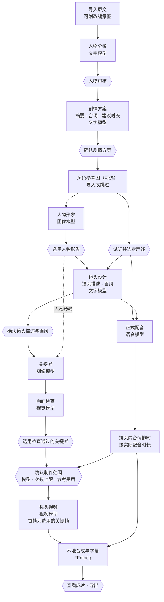

# 架构与流程

[← 返回首页](../README.md)

## 分层结构

| 层次 | 职责 | 技术 |
|---|---|---|
| 桌面界面 | 八步流程与对话推进、候选查看与选用、制作确认、播放与导出 | PySide6 · Qt Quick / QML |
| 任务编排 | 分阶段任务、制作范围与参考费用、人工决定记录、请求发送与远端任务跟踪、恢复与复用 | Python |
| 模型适配 | 按用途封装五类服务的请求与响应解析，校验结构化输出 | Python · HTTP |
| 任务状态 | 阶段检查点、候选与选用、人工决定、请求记录与远端任务编号 | SQLite |
| 媒体文件 | 人物形象、关键帧、配音、视频片段、字幕与成片 | 本地文件 |
| 合成与导出 | 时间轴、合成、字幕渲染、导出校验 | FFmpeg / ffprobe |

## 制作流程

六边形为需要用户确认或选用的节点。

## 状态保存与恢复

- 每一步的进度、候选与选用、人工决定和请求记录都保存在本地数据库，应用重启后回到上次的任务。
- 远端视频仍在生成时，继续制作会接着获取同一个任务，不会重新提交。
- 区分请求失败、结果未知和内容审核未通过；结果未知的请求不会自动重发。
- 新一轮制作只为缺少结果的镜头发起请求，已保存的镜头、关键帧和配音直接复用。
- 项目固定所用的模型配置，不会自动改用其他模型。

## 配音、合成与字幕

- 视频制作前先生成正式配音，镜头内台词按实际配音时长排布；预览、制作前检查和最终合成使用同一套排时规则。
- FFmpeg 在本地按时间轴合成镜头视频与配音。
- 播放器字幕、SRT/VTT 文件和带字幕视频共用同一份字幕数据。
- 可导出带字幕或无字幕的视频、SRT 字幕和项目资料包。
