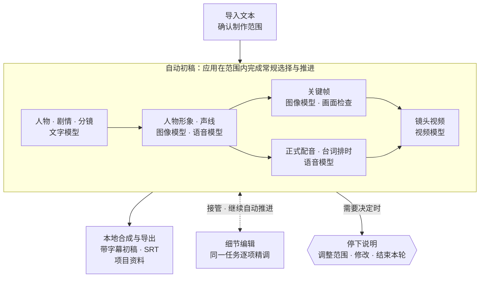

# 架构与流程

[← 返回首页](../README.md)

## 分层结构

| 层次 | 职责 | 技术 |
|---|---|---|
| 桌面界面 | 自动初稿与细节编辑（同一任务）、范围确认、候选查看与选用、播放与导出 | PySide6 · Qt Quick / QML |
| 任务编排 | 制作范围与委托执行、分阶段任务、候选与选用、请求发送与远端任务跟踪、恢复与复用 | Python |
| 模型适配 | 按用途封装五类服务的请求与响应解析，校验结构化输出 | Python · HTTP |
| 任务状态 | 阶段进度、候选与选用、自动与人工决定、请求记录与远端任务编号 | SQLite |
| 媒体文件 | 人物形象、关键帧、配音、视频片段、字幕与成片 | 本地文件 |
| 合成与导出 | 时间轴、合成、字幕渲染、导出校验 | FFmpeg / ffprobe |

## 制作流程

```mermaid
flowchart TB
    IN["导入文本<br/>确认制作范围"] --> PIPE
    subgraph PIPE["自动初稿：应用在范围内完成常规选择与推进"]
        T["人物 · 剧情 · 分镜<br/>文字模型"] --> L["人物形象 · 声线<br/>图像模型 · 语音模型"]
        L --> K["关键帧<br/>图像模型 · 画面检查"]
        L --> V["正式配音 · 台词排时<br/>语音模型"]
        K --> M["镜头视频<br/>视频模型"]
        V --> M
    end
    PIPE --> OUT["本地合成与导出<br/>带字幕初稿 · SRT<br/>项目资料"]
    PIPE <-.->|"接管 · 继续自动推进"| EDIT["细节编辑<br/>同一任务逐项精调"]
    PIPE -->|"需要决定时"| STOP{{"停下说明<br/>调整范围 · 修改 · 结束本轮"}}
```

- **范围**：开始前确认一次制作范围（风格、上传素材、调用上限与服务条款）。每次发送前都会按这个范围核对，范围之外的请求不会发出。
- **自动推进**：常规选择由应用代为完成，并记为自动选择。关键帧检查未完全通过时，符合初稿规则的候选可以带着检查备注继续使用，缺少必需条件的不会放行，检查结论也不会被改写。
- **接管与精调**：随时可以接管同一任务，应用在下一步之前暂停；在细节编辑中按步骤修改后，可以继续自动推进，也可以结束本轮。
- **停下说明**：范围用尽、服务方拒绝、结果未知等情况需要你决定，应用会停下并说明原因。

## 状态保存与恢复

- 每一步的进度、候选与选用、自动与人工决定、请求记录都保存在本地数据库；重新打开应用后回到原任务，已完成的成片直接播放。
- 远端已接受的视频任务，继续时接着取回同一个结果，不重新提交。
- 请求失败、结果未知与服务方拒绝分别处理：结果未知的请求不自动重发，被拒绝的相同输入不会原样再发；单个镜头可以按原因单独返工，例如更换首帧后只重做该镜头。
- 新一轮制作只为缺少结果的部分发起请求，已保存的镜头、关键帧和配音直接复用。
- 项目固定所用的模型配置，不会自动改用其他模型。

## 配音、合成与字幕

- 旁白与台词先用选定的声线生成正式配音，并按实际时长排布；开口说话的镜头可以把配音作为参考音频交给视频模型，生成带原生声音的画面。
- FFmpeg 在本地按时间轴合成镜头视频与声音，并把字幕渲染进带字幕版本。
- 播放器字幕、SRT 文件和带字幕视频共用同一份字幕数据。
- 交付内容：成片、带字幕视频、SRT 字幕和项目资料包。
